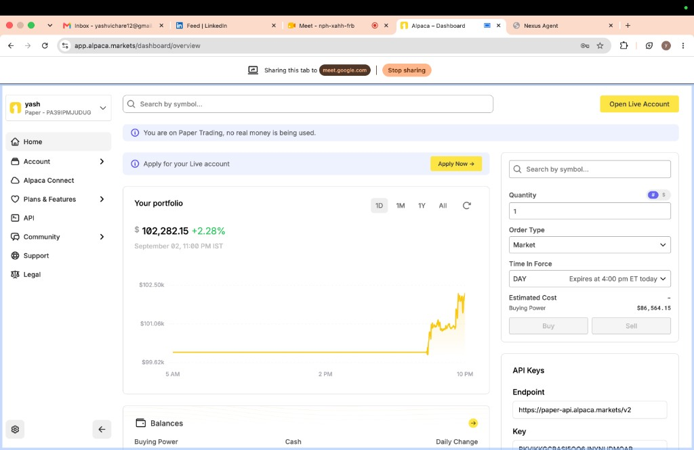
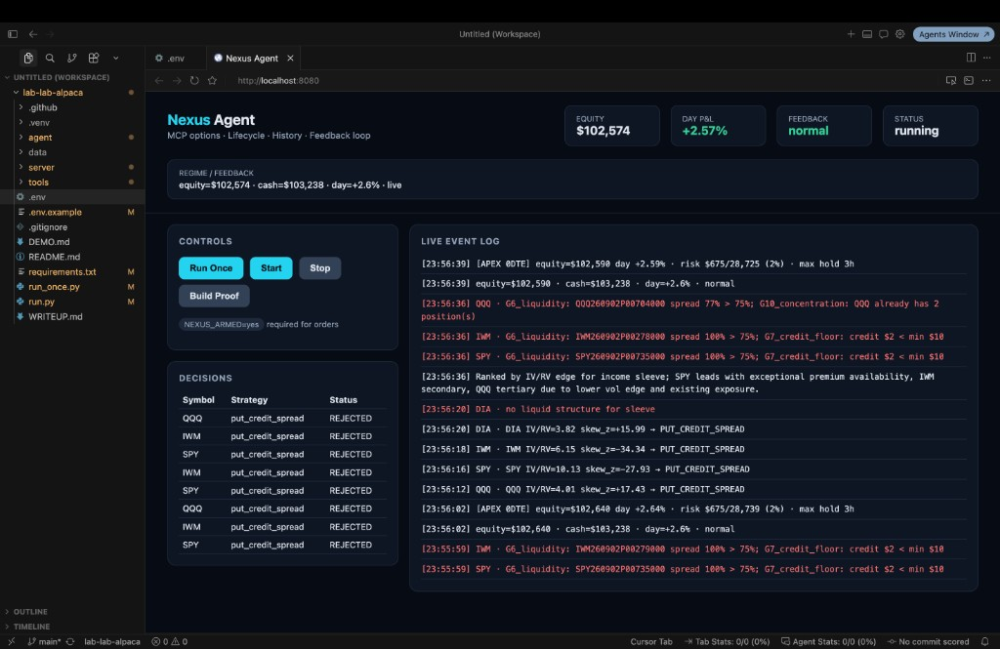
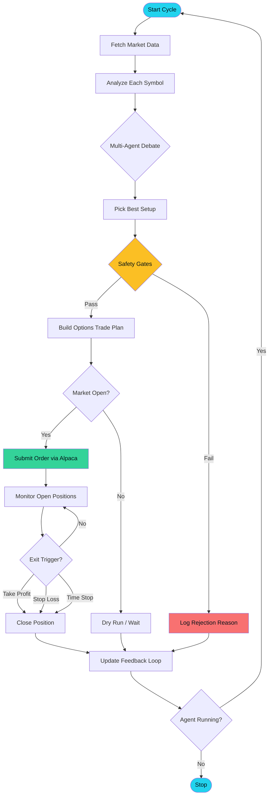
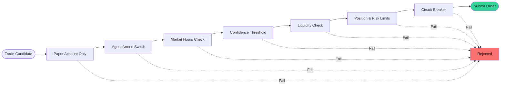

# Nexus Agent

**An autonomous options trading agent for Alpaca Trading**

Nexus Agent watches the market, reads the signals, debates the best move, and places defined-risk options trades — all on autopilot. It was built for the [Alpaca AI Trading Agents Hackathon](https://alpaca.markets).

---

## Results at a Glance

Paper trading performance from live runs:

| Metric | Snapshot |
|--------|----------|
| Starting balance | $100,000 |
| Peak portfolio value | **$109,706** (+9.71%) |
| Best single-day P&L | **+7.80%** |
| Environment | Alpaca Paper Trading |

---

## Screenshots

### Alpaca Paper Trading Dashboard

Real account performance tracked through Alpaca's official dashboard.

<p align="center">
  
  <br /><em>Portfolio growth during an active trading session (+2.28%)</em>
</p>

<p align="center">
  
  <br /><em>Peak session performance (+9.71% on $109,706 portfolio value)</em>
</p>

### Nexus Agent Live Dashboard

The built-in control panel shows every decision, rejection reason, and live event in real time.

<p align="center">
  
  <br /><em>Agent running with live decisions, event log, and equity tracking (+2.57%)</em>
</p>

<p align="center">
  
  <br /><em>Feedback loop in caution mode after a strong session (+7.80% day P&L)</em>
</p>

---

## What Does Nexus Do?

Think of Nexus as a **disciplined trading desk in a box**. Every few seconds it:

1. **Scans** a watchlist of major ETFs and stocks (SPY, QQQ, IWM, DIA, and more)
2. **Reads the market** — price trends, news sentiment, and volatility conditions
3. **Debates** the best action through a three-agent committee (Bull, Bear, and Portfolio Manager)
4. **Picks a strategy** — the right options structure for the current market mood
5. **Checks safety rules** — only trades that pass every gate get submitted
6. **Executes** on Alpaca Paper Trading and monitors open positions until exit

The goal is not to trade often — it is to trade **only when the setup is clear and the risk is controlled**.

---

## Strategy Overview

Nexus adapts its approach based on what the market is doing. Here is the plain-language breakdown:

### When the market looks bullish
→ **Bull call spread** — limited cost, defined upside if price rises.

### When the market looks bearish
→ **Bear put spread** — profits from a downward move with capped risk.

### When volatility is cheap (IV low vs. realized vol)
→ **Long strangle** — bets on a big move in either direction.

### When volatility is rich and price is range-bound
→ **Put credit spread / iron condor** — collects premium when the market stays calm.

### Intraday "Apex" mode (0DTE)
For same-day expiry trades, Nexus focuses on **put credit spreads** on index ETFs. It ranks candidates by the **IV/RV edge** (implied vs. realized volatility) and only enters when liquidity, credit floor, and position limits all pass.

| Signal | What it means |
|--------|---------------|
| IV/RV ratio | Is option premium rich or cheap relative to recent price swings? |
| Volatility skew | Are puts or calls relatively more expensive? |
| News sentiment | Is headline flow bullish, bearish, or neutral? |
| Technical score | Trend, momentum, and pattern confirmation |
| Feedback loop | Slows down after strong gains; enters caution mode to protect profits |

---

## How It Works — Flowchart



### Safety gates (every trade must pass all of these)



Most rejections you see in the dashboard (wide spread, credit too low, max positions reached) are the system doing its job — **skipping bad trades is a feature, not a bug**.

---

## Key Features

- **Live dashboard** — equity, day P&L, decisions table, and streaming event log at `localhost:8080`
- **Bring your own keys** — visitors paste Alpaca paper keys in the dashboard form (no shared secrets in the deploy)
- **Multi-signal fusion** — technicals, news, volatility regime, and pattern detection combined
- **AI debate committee** — Bull, Bear, and Portfolio Manager reach consensus before any trade
- **Defined-risk options only** — spreads and condors with known max loss
- **Feedback loop** — automatically shifts to caution mode after strong sessions
- **Fail-closed safety** — `NEXUS_ARMED=yes` required; paper trading enforced; circuit breakers halt bad days
- **Full audit trail** — every decision, rejection, and order logged to SQLite

---

## Quick Start

### 1. Install dependencies

```bash
python3 -m venv .venv
source .venv/bin/activate
pip install -r requirements.txt
```

### 2. Configure Alpaca paper keys

On a shared deploy (Railway), leave keys out of the environment. Open the dashboard and paste **your** paper keys in the setup form.

For a local `.env` instead:

```bash
cp .env.example .env
# Edit .env with your Alpaca paper API keys
```

### 3. Launch the dashboard

```bash
python run.py
```

Open **http://localhost:8080** in your browser.

### 4. Run the agent

- Click **Run Once** to scan one cycle without looping
- Click **Start** to run continuously during market hours
- Arm live paper orders with the dashboard checkbox, or set `NEXUS_ARMED=yes` in `.env` only when you are ready

---

## Project Structure

```
lab-lab-alpaca/
├── agent/          # Core trading logic, signals, risk, and strategy
├── server/         # FastAPI dashboard and live event stream
├── tools/          # Utilities — proof builder, analysis, calibration
├── docs/images/    # Screenshots and result captures
├── run.py          # Start the dashboard server
├── run_once.py     # Single-cycle CLI run
└── .env.example    # Configuration template
```

---

## Safety & Disclaimer

> **This project is for paper trading and educational purposes only.**
> No real money is used. Past paper-trading results do not guarantee future performance.
> Options trading involves substantial risk. Do not use this software with live accounts
> without fully understanding the strategies and risks involved.

- Paper trading is enforced at multiple layers (hostname check, env flags, account binding)
- The agent will not place orders unless `NEXUS_ARMED=yes`
- A circuit breaker halts new trades if daily losses exceed the configured threshold

---

## Built For

**Alpaca AI Trading Agents Hackathon** — demonstrating autonomous, multi-signal options trading with real-time risk management on Alpaca's paper trading infrastructure.

---

<p align="center">
  <strong>Nexus Agent</strong> · Paper trading only · Built with Alpaca MCP + FastAPI
</p>
